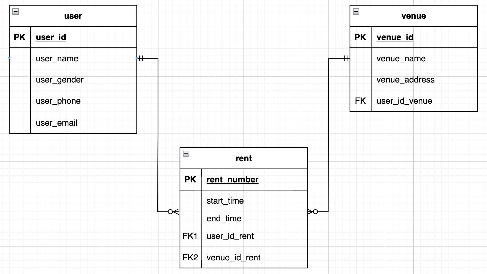

# 112-1 Database Systems

## Class Information
> + Teacher：蔡芸琤
> + Name：林鈺茹
> + Department and Grade：科技系114年級
## Index
> + [Notes](https://github.com/Lindergithub/DB/blob/main/README.md#index)
> + [Homework](https://github.com/Lindergithub/DB/tree/main#notes)
> + [Final Project](https://github.com/Lindergithub/DB/tree/main#final-project)
## Notes
### [DB repo](https://docs.google.com/spreadsheets/d/1Q7xZrNQcNulzj7rhAGlexjkjkXMrw-MnCfyo7CtSp_o/edit#gid=847386397)
### PPT
> + [week1](https://docs.google.com/presentation/d/1CP0D92DA8Ae8oyIKSquqUuTUpVqwLGT-14T32l9pf5U/edit#slide=id.g2410febba22_0_9) & [Video](https://youtu.be/idhUbF1req4?si=R2vEFacyfHN5T-U6)
> + [week2](https://docs.google.com/presentation/d/1amn8pDX2Wx4N6ZjzhCGoQFJH4DqaRcQ2DJAdg3hbIrA/edit#slide=id.g23dd2219a46_0_124) & [Video](https://www.youtube.com/watch?v=qGaGgdm_YtY)
> + 參訪
> + [week4](https://docs.google.com/presentation/d/1053jwkOvLAdeQCDUJKq-c0NwxB3jOqlkiL244y0DPro/edit#slide=id.g24725b3e1c1_0_277) & [Video](https://www.youtube.com/watch?v=YjItfF4FkIo)
> + [week5](https://docs.google.com/presentation/d/1J0ASP97LgjTQeKqTdm1vRhxh6MGya-C1D-8w7ykUPqE/edit#slide=id.g23dd2219a46_0_124) & [Video](https://www.youtube.com/watch?v=SkouS0krH98)
> + [week6]()
> + [week7](https://docs.google.com/presentation/d/1VGS4z-40x0ZS8baC3PHP4TBLZn3S3YEe9owg4_vIZWc/edit#slide=id.g23dd2219a46_0_124) & [Video](https://www.youtube.com/watch?v=ukF48qw2LM8)
> + [week8](https://docs.google.com/presentation/d/1VGS4z-40x0ZS8baC3PHP4TBLZn3S3YEe9owg4_vIZWc/edit#slide=id.g23dd2219a46_0_124)
> + [week9](https://docs.google.com/presentation/d/1g1mkza7Uufm9A4fwRI_fJRAcWf-QTFf9Jn00I8iiLM0/edit#slide=id.g23dd2219a46_0_124) & [Video1](https://www.youtube.com/watch?v=yw8yP0eAKDs)[Video2](https://www.youtube.com/watch?v=JE0E4G73OjQ)
## Homework
#### [HW0](https://youtu.be/fMhPyYBAz6M)
> References：
> + [React, NodeJS, and MySQL](https://www.byperth.com/2018/04/19/guide-building-data-science-web-application-with-react-nodejs-and-mysql/)
> + [Client-server](https://madooei.github.io/cs421_sp20_homepage/client-server-app/)
> + [Client-server in Chinese](https://hackmd.io/@Willie-The-Lord/BJ7ZP2hgY)

> References Video：
> + [Beginners CRUD Tutorial - ReactJS, MySQL, NodeJS](https://www.youtube.com/watch?v=re3OIOr9dJI)
#### [HW1](https://youtu.be/DUsJ380Z8x8)

#### [HW2]()
#### [HW3]()
#### [HW4]()
#### [HW5]()
## Final Project
#### [ppt]()
#### [vedio]()
